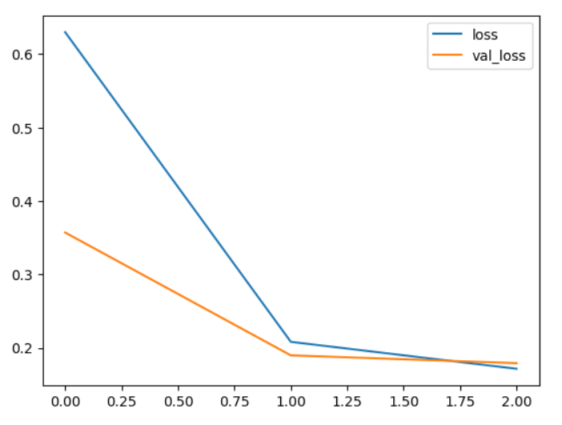
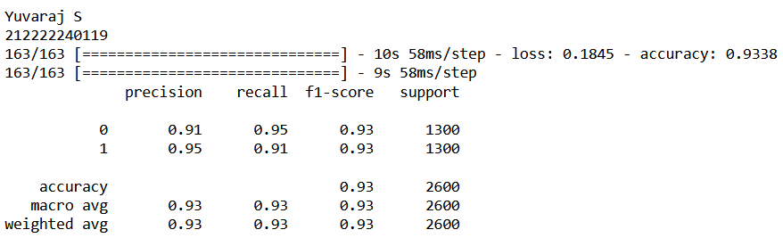
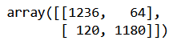
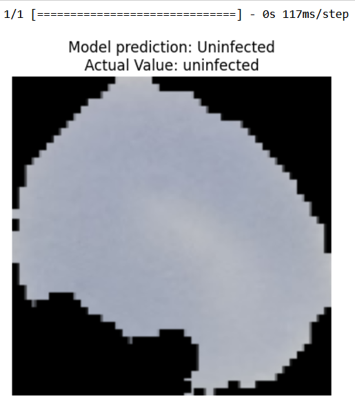

# Deep Neural Network for Malaria Infected Cell Recognition

## AIM

To develop a deep neural network for Malaria infected cell recognition and to analyze the performance.

## PROBLEM STATEMENT AND DATASET

We have a directory with a number of images of infected cells and uninfected cells. Using an image generator, we augment the data into multiple images. We pass the data to the model and train the model accordingly using the required number of neurons.

## NEURAL NETWORK MODEL


## DESIGN STEPS

### Step 1:
Define the directory for the dataset. Extract the dataset files if needed.
### Step 2:
Define the image Generator engine with the necessary parameters.
### Step 3:
Pass the directory to the image generator.
### Step 4:
Define the model with appropriate neurons.
### Step 5:
Pass the training and validation data to the model.
### Step 6:
Plot the necessary graphs.

## PROGRAM
```python
import os
import pandas as pd
import numpy as np
import seaborn as sns
import matplotlib.pyplot as plt
from matplotlib.image import imread
from tensorflow.keras.preprocessing.image import ImageDataGenerator
from tensorflow import keras
from tensorflow.keras import layers
from tensorflow.keras import utils
from tensorflow.keras import models
from sklearn.metrics import classification_report,confusion_matrix
import os
# for Google Colab
!tar --skip-old-files -xvf '/content/drive/MyDrive/Dataset/cell_images.tar.xz' -C '/content/drive/MyDrive/Dataset/'

# for Google Colab
my_data_dir = 'dataset/cell_images/'

os.listdir(my_data_dir)

test_path = my_data_dir+'/test/'
train_path = my_data_dir+'/train/'

os.listdir(train_path)

len(os.listdir(train_path+'/uninfected/'))

os.listdir(train_path)

len(os.listdir(train_path+'/uninfected/'))

len(os.listdir(train_path+'/parasitized/'))

os.listdir(train_path+'/parasitized')[0]

para_img= imread(train_path+
                 '/parasitized/'+
                 os.listdir(train_path+'/parasitized')[0])

plt.imshow(para_img)

# Checking the image dimensions
dim1 = []
dim2 = []
for image_filename in os.listdir(test_path+'/uninfected'):
    img = imread(test_path+'/uninfected'+'/'+image_filename)
    d1,d2,colors = img.shape
    dim1.append(d1)
    dim2.append(d2)

sns.jointplot(x=dim1,y=dim2)

image_shape = (130,130,3)

help(ImageDataGenerator)

image_gen = ImageDataGenerator(rotation_range=20, # rotate the image 20 degrees
                               width_shift_range=0.10, # Shift the pic width by a max of 5%
                               height_shift_range=0.10, # Shift the pic height by a max of 5%
                               rescale=1/255, # Rescale the image by normalzing it.
                               shear_range=0.1, # Shear means cutting away part of the image (max 10%)
                               zoom_range=0.1, # Zoom in by 10% max
                               horizontal_flip=True, # Allo horizontal flipping
                               fill_mode='nearest' # Fill in missing pixels with the nearest filled value
                              )

image_gen.flow_from_directory(train_path)

image_gen.flow_from_directory(test_path)

model = models.Sequential()
model.add(layers.Conv2D(filters=64, kernel_size=(3,3),input_shape=image_shape, activation='relu',))
model.add(layers.MaxPooling2D(pool_size=(2, 2)))

model.add(layers.Conv2D(filters=32, kernel_size=(5,5), activation='relu',))
model.add(layers.MaxPooling2D(pool_size=(2, 2)))

model.add(layers.Conv2D(filters=16, kernel_size=(3,3), activation='relu',))
model.add(layers.MaxPooling2D(pool_size=(2, 2)))


model.add(layers.Flatten())

model.add(layers.Dense(128))
model.add(layers.Activation('relu'))
model.add(layers.Dropout(0.5))


model.add(layers.Dense(64))
model.add(layers.Activation('relu'))

model.add(layers.Dense(1))
model.add(layers.Activation('sigmoid'))

model.compile(loss='binary_crossentropy',
              optimizer='adam',
              metrics=['accuracy'])
model.summary()

batch_size = 16
help(image_gen.flow_from_directory)

train_image_gen = image_gen.flow_from_directory(train_path,
                                               target_size=image_shape[:2],
                                                color_mode='rgb',
                                               batch_size=batch_size,
                                               class_mode='binary')

train_image_gen.batch_size
len(train_image_gen.classes)
train_image_gen.total_batches_seen

test_image_gen = image_gen.flow_from_directory(test_path,
                                               target_size=image_shape[:2],
                                               color_mode='rgb',
                                               batch_size=batch_size,
                                               class_mode='binary',shuffle=False)
train_image_gen.class_indices
results = model.fit(train_image_gen,epochs=3,validation_data=test_image_gen)

model.save('cell_model.h5')
losses = pd.DataFrame(model.history.history)
print("Yuvaraj S")
print("212222240119")
losses[['loss','val_loss']].plot()

model.metrics_names
model.evaluate(test_image_gen)
pred_probabilities = model.predict(test_image_gen)
test_image_gen.classes

predictions = pred_probabilities > 0.5
print(classification_report(test_image_gen.classes,predictions))
confusion_matrix(test_image_gen.classes,predictions)
import random
model=models.load_model("cell_model.h5")
list_dir=["uninfected","parasitized"]
dir_=(random.choice(list_dir))
para_img= imread(train_path+
                 '/'+dir_+'/'+
                 os.listdir(train_path+'/'+dir_)[random.randint(0,10000)])
img  = tf.convert_to_tensor(np.asarray(para_img))
img = tf.image.resize(img,(130,130))
img=img.numpy()
pred=bool(model.predict(img.reshape(1,130,130,3))<0.5 )
plt.title("Model prediction: "+("Parasitized" if pred  else "Uninfected")+"\nActual Value: "+str(dir_))
plt.axis("off")
plt.imshow(img)
plt.show()
```
## OUTPUT

### Training Loss, Validation Loss Vs Iteration Plot



### Classification Report



### Confusion Matrix



### New Sample Data Prediction


## RESULT
Thus, we have successfully created a deep neural network for Malaria infected cell recognition and analyzed the performance.
